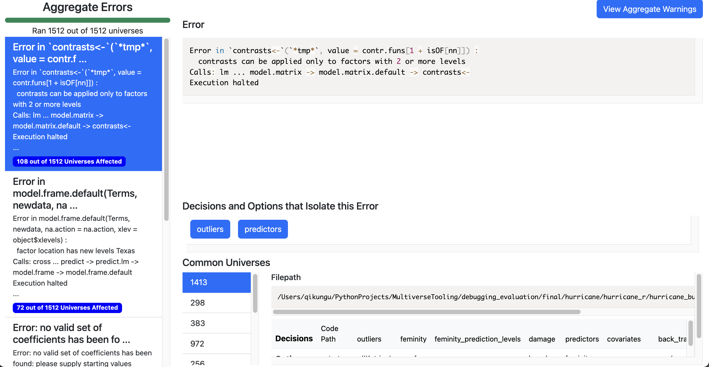
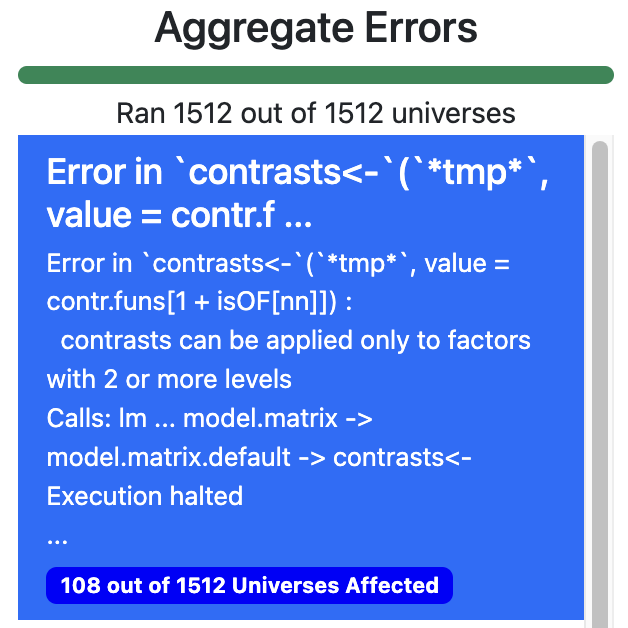
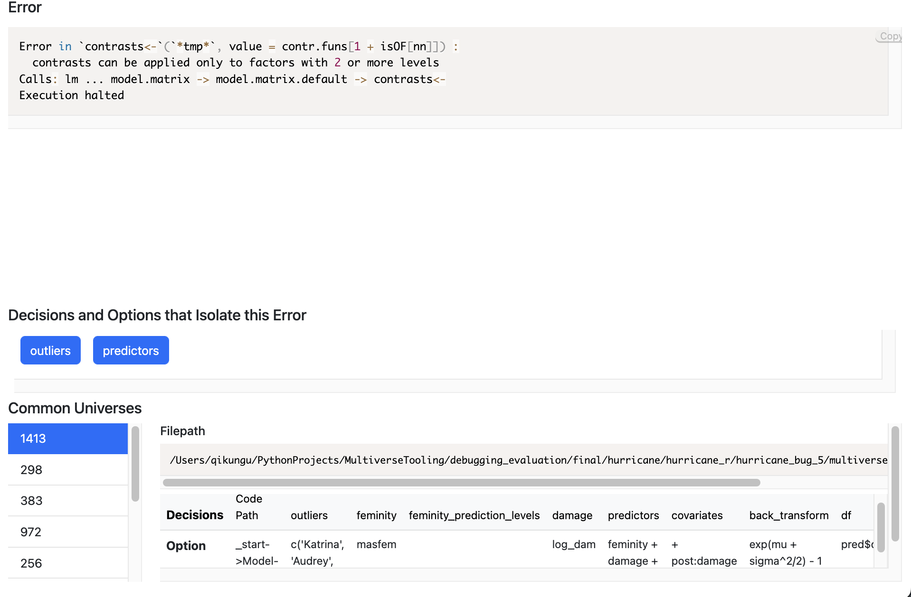
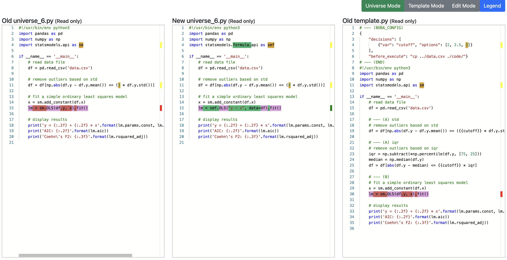
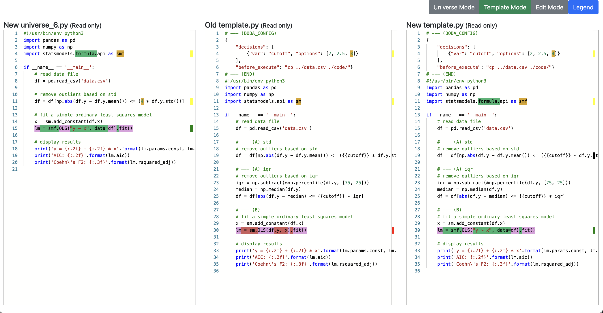
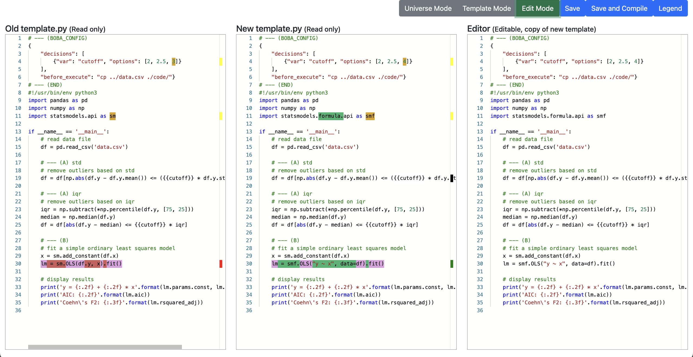

# Multiverse Debugging CLI Suite

Welcome to our multiverse debugging CLI suite, a series of CLI features built on top of Boba to make debugging multiverse analyses easier. In traditional multiverse analysis with Boba, we envision the workflow for debugging as 

1. Identifying specific errors to docus on
2. Examining common analysis paths that share this error
3. Focusing on one specific error
4. Applying the solution to all selected path. 

From this understanding of the workflow, we built 3 CLI features on top of Boba to help with these worfklows.

## Multiverse Code Cover Sweep
### Previously
The order of running the multiverse is arbitrary. As a result, when running the multiverse, it may take half the multiverse (half the number of universes) to run before one decision corresponding to an error is run. 

## Now
We add the following command
```
boba run --cover
```
This runs a minimal set of universes such that all decisions and all options are covered. The motivation is that if there is an error somewhere in the code, we will detect it early. (**Worfklow Step #1**). Running this command will also spin up the error dashboard described in the next section. 

### Intended User Case
An initial sanity check.

## Multiverse Error Aggregation
### Previously

Right now, there are a lot of errors all seperated in hundreds, potentially thousands of log files. Many of these errors, are repeating.

We have to manually look at the error logs and find an error without an accurate understanding of what decisions and options may affect it or how many universes are affected.


### Now

We provide a dashboard to see the errors aggregated. We also help identify common decisions that could help isolate the error. 

Once the multiverse is already running or has finished running ie. there are error log files, we can run the command
```
boba error
```
to spin up a dashboard that shows the aggregation of errors. 

This feature is to help **workflow steps 2 and 3**. 

### Intended User Case

Understand the existing errors better.

### GUI


### Left Side Panel
The side panel on the left is used to navigate through groups of errors. For each error, you will see a teaser of its error string, and the number of universes affected (from the one's ran so far)


### Main Panel
In the main panel, the full error text will be shown. In addition, based on the number of universes ran so far, we determine the **decisions and options that may isolate this error**. Each blue button shows a decision and clicking on it shows the relevant option. 

Finally, towards the bottom of the main panel, you can see common universes that share this error. Clicking on one shows the filepath, and the decisions and options associated with that universe.



## Universe to Template Diff
The previous features help with workflow steps 1, 2 and 3. This feature is intended to help with the final step: translating changes from the universe file to the tempalte file.
### Previously
You would have to remember all the changes and edits you make to a unvierse file and then propogate them pack to the template file. If there are a lot of edits, it is prone to error which could bring more bugs. 

### Now
We introduce an automatic universe to template diff GUI. Based on changes you make to the universe file we automatically generate the corresponding template diff. The diffs act as suggestions before which you can make additional edits if necessary. 
#### Universe View
This view lets you see the changes between the old universe and the new universe. 

#### Template View
This view lets you see the changes between the old and new template files along with the newly edited universe file.


#### Edit View
This view lets you see the changes between the old and new template file and also an editor that contains the contents of the suggested new template file. You can make final edits here before saving this file to disk or saving it and also compiling the boba multiverse.

